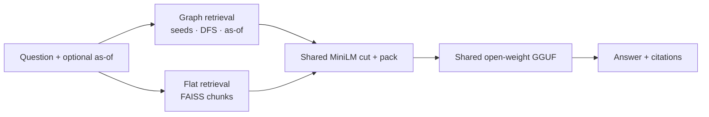

# conqr-denny-legal

**Core hypothesis:** legal QA over amended agreements is not purely a semantic
retrieval problem. Some answers require traversing explicit relationships
(definitions, exceptions, cross-references, parties) and resolving which text was
**operative on the question’s as-of date**.

This repo is a temporal legal knowledge graph + retrieval pipeline over Denny’s
Third Amended & Restated Credit Agreement (2017) and its amendments, plus a flat
RAG baseline under matched experimental controls.

Generation runs locally on an open-weight GGUF. AWS Bedrock is used only as an
**offline evaluator**, so the live answer path does not depend on a proprietary API.

---


## Problem

A credit agreement is not a bag of passages. Answering often depends on:

1. **Cross-references** — §7.10 → Event of Default → remedies; top‑k similarity may land on only the first hop.
2. **Amendments over time** — the same section has different operative text before and after an effective date.
3. **Exceptions and dependents** — the binding rule may live on a carve‑out edge or an inbound dependency, not on the section that matches the query wording.
4. **Parties** — roles are structured facts, not free text the embedder is guaranteed to surface.

Flat RAG optimizes for semantic similarity. That is necessary but not sufficient here.

---


## Results


| Metric | Graph path | Flat RAG |
|---|:---:|:---:|
| **Held-out hard set** | **16/20** | **9/20** |
| Final assignment-set score | **12/12** | 5/12 |
| Context recall | **1.00** | 0.48 |
| Version correct | **1.00** | 0.67 |
| Amendment-status citations | **29** | 0 |

The 12 assignment questions were used during development; see [Evaluation methodology](#evaluation-methodology-read-this-before-the-1212). The held-out set is the cleaner generalization check (graph **16/20** vs flat RAG **9/20** on the same 20 questions, same generator and judge).

**How to read those metrics**

- **Context recall** — fraction of annotated gold evidence *node IDs* that appear in the packed prompt’s `context_ids` (not “somewhere in a candidate list”).
- **Version correct** — on date-dependent questions, whether the answer uses the operative text for the stated as-of date.
- **Amendment-status citations** — count of citations across the 12 answers that label version status (e.g. “as amended by Second Amendment…”). Graph path emits these; the flat baseline produced **0** on the frozen 12-question run.

Snapshot: `[eval/frozen/](eval/frozen/)`. Regenerating answers writes to `outputs/` and does **not** overwrite the frozen files.

---


## Concrete example: where flat RAG fails

Restricted payments as-of. The brief asked for Q9/Q10 “as of the date given in the question set” but did not give dates.
Those dates are **documented evaluation assumptions**: Q9 = **2018-01-01**, Q10 = **2020-06-01**
(bracketing the Second Amendment effective 2020-05-13).

**Question (Q9):** maximum permitted restricted payment as of **2018-01-01**.


| Path     | What happens                                                                                                                                                                                                              |
| -------- | ------------------------------------------------------------------------------------------------------------------------------------------------------------------------------------------------------------------------- |
| Flat RAG | Retrieves highly similar §7.05 text, but has no mechanism to prefer the *pre–Second Amendment* operative body. On the frozen run it is judged **incorrect** (baseline misses Q9).                                         |
| Graph    | Seeds §7.05 → follows `AMENDS` → `find_effective(..., as_of=2018-01-01)` returns the originally executed text (Second Amendment effective 2020-05-13 is excluded). Citation carries amendment status. Judged **correct**. |


Q10 asks the same question as of **2020-06-01**. Same section node; different operative text after applying later `AMENDS` ops. That contrast is the point of the graph.

---


## Why not flat RAG alone?


| Failure mode                    | What flat top‑k tends to do                                                              | What the graph adds                        |
| ------------------------------- | ---------------------------------------------------------------------------------------- | ------------------------------------------ |
| Multi-hop chain (Q7)            | Returns the covenant; misses grace/remedy siblings                                       | `REFERENCES` + sibling hop via `CONTAINS`  |
| Exhaustive amendment list (Q11) | Cannot enumerate every `AMENDS` edge                                                     | Deterministic amendment catalog projection |
| Dependents of a definition (Q4) | May miss inbound edges                                                                   | `DEPENDS_ON` / inbound neighbor helpers    |
| Party roster (Q3)               | Party membership is represented structurally rather than as a retrieval-friendly passage | `PARTY_TO` roster block                    |
| As-of (Q9/Q10)                  | Similarity ≠ effective date                                                              | `find_effective` on `AMENDS`               |


Baseline still wins or ties on questions a single well-retrieved passage can settle (e.g. governing law). The graph’s job is the structural remainder.

---


## Evaluation methodology (read this before the 12/12)

**I iterated against the assignment’s 12 questions during development.** The frozen 12/12 is therefore a final scored snapshot of that set, not evidence of zero leakage.

What limits overfitting claims:


| Set           | Provenance                                                                                                         | Role                                                                                                       |
| ------------- | ------------------------------------------------------------------------------------------------------------------ | ---------------------------------------------------------------------------------------------------------- |
| Assignment 12 | Brief questions (verbatim)                                                                                         | Iterated during build; **frozen final scores** in `eval/frozen/`                                           |
| Held-out 20   | Manually written hard cases targeting amendment evolution, as-of, conflict, dependents, false premise, aggregation | **Not used to tune retrieval**. Used for context-shaping ablation (kept blocks off). Final score **16/20** |
| Clustered ~88 | Structure-sampled retrieval probes                                                                                 | Development / regression signal (Tier‑1, no generator)                                                     |


**Controlled comparison (graph vs baseline)**

Both paths share: embedder, reranker, generator GGUF, prompt template, generation settings (temperature 0, same max tokens / thinking config), the same 12 questions, and the same Bedrock judge harness. The intended difference is the **structured retrieval path** (graph traversal + as-of resolution + a few graph-only context projections such as catalog / parties / dependents) versus FAISS top‑30 chunks then the same MiniLM cut.

---


## Approach

```text
                 ┌─────────────────────────────────────────┐
  question       │  GRAPH PATH                             │
  (+ as_of) ───► │  seeds → DFS → find_effective → pack   │──► same GGUF
                 │  (+ catalog / parties / dependents…)    │     + prompt
                 └─────────────────────────────────────────┘
  question ────► ┌─────────────────────────────────────────┐
                 │  BASELINE                               │──► same GGUF
                 │  FAISS top-30 → same MiniLM top-k       │     + prompt
                 └─────────────────────────────────────────┘
```




Graph internals (one hop deeper): hybrid seeds → depth-limited DFS over legal edges → apply `AMENDS` with `effective_date ≤ as_of` → stage‑2 sibling/hub expansion → pack reserved evidence first so retrieved nodes are not dropped when the prompt is full → generate.

Schema detail (4 node types, 7 edge types, ~740 nodes) lives in [writeup.md](writeup.md) — enough to say here that `AMENDS`, `DEPENDS_ON`, `REFERENCES`, `EXCEPTION_TO`, and `PARTY_TO` exist because specific question classes require them.

---


## Reproduction

```bash
git clone <repo> && cd conqr-denny-legal
make setup              # uv sync (+ CUDA llama-cpp if generating locally)
make install-model      # Qwen3.6-27B Q4_K_M (~17 GB) — selected final generator
cp .env.example .env    # LLM_BACKEND=local
```

`artifacts/` (graph + index) is committed — no rebuild required to answer.

```bash
uv run python answer.py --question "What is the governing law?" --as-of 2020-06-01
make test               # 94 tests, no GPU / no network
make probe              # gold-node recall without calling the generator
make scorecard          # print frozen scoreboard head
```

Optional: `make answers` then `make eval` regenerates into `outputs/` (GPU + Bedrock). Prefer the frozen snapshot for review.

**Tests worth noticing:** 94 automated tests cover as-of resolution, traversal helpers, context packing (reserved blocks cannot be evicted), citation/catalog projections, and integrity of the frozen submission files.

---


## Engineering details


| Choice                     | Selection basis                                                                                                           |
| -------------------------- | ------------------------------------------------------------------------------------------------------------------------- |
| Embedder `dinghy-law-0.6b` | Best recall@10 / MRR@10 among candidates tried on this corpus (see experiment summary)                                    |
| Reranker MiniLM-L-12       | Working CrossEncoder; one legal-branded checkpoint shipped without a usable classifier head                               |
| Generator Qwen3.6-27B Q4   | Best-performing generator in the evaluated model ladder on the assignment set; smaller/faster GGUFs plateaued at ~5–7/12. |
| NetworkX (not Neo4j)       | Corpus is ~700 nodes; clone→run without a DB                                                                              |
| Context-shaping blocks OFF | Holdout ablation: graph-only **17/20** vs full scaffolding **15/20** — extra blocks hurt generalization                   |


**Latency / hardware:** graph path p50 ≈ **123 s/answer** on an **NVIDIA A10G** (~24 GB) with the 27B Q4 GGUF (`n_ctx=16384`). That is a quality-over-latency choice for the take-home, not a production SLA. Faster GGUFs (~10 s) exist and score worse on this set.

---


## Limitations

- LLM-as-judge introduces variance; citation/temporal verifiers exist partly to sanity-check the judge.
- One agreement family (Denny’s); schema claims do not automatically transfer.
- NetworkX is appropriate for this single-agreement take-home, but a production multi-tenant system at 10k+ documents would need a persistent graph store.
- The temporal layer tracks amendment operations, but does not yet reconstruct a full redline showing exactly which original text was replaced or deleted.
- Q9/Q10 as-of dates are **documented assumptions** (brief said “the date given” but gave none).
- System answers from the supplied filings only — not legal advice.

---


## Takeaways

1. Flat semantic retrieval missed evidence required for multi-hop, party, catalog, and some as-of questions on this brief.
2. The structured retrieval path improved evidence recall and temporal correctness under matched models and prompts.
3. Not every context-shaping idea survived holdout ablation — the final path keeps several experimental blocks **off**.
4. Final frozen scores: **12/12** assignment (graph) vs **5/12** baseline; holdout **16/20** graph vs **9/20** flat RAG.

---


## Layout

```text
data/Dennys/       Source filings (base + three amendments)
ingestion/         Rule-based HTML / OCR parse (no LLM)
graph/             Schema, as-of traversal, seeding
retrieval/         Graph answer path
baseline/          Flat FAISS RAG (shared models + prompt)
llm/               Local GGUF client
eval/frozen/       Scored submission snapshot
experiments/       Model / retrieval evidence
artifacts/         Committed graph.json + FAISS index
tests/             94 unit tests
writeup.md         Full narrative for the brief (Remaining to upload)
```

